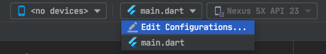
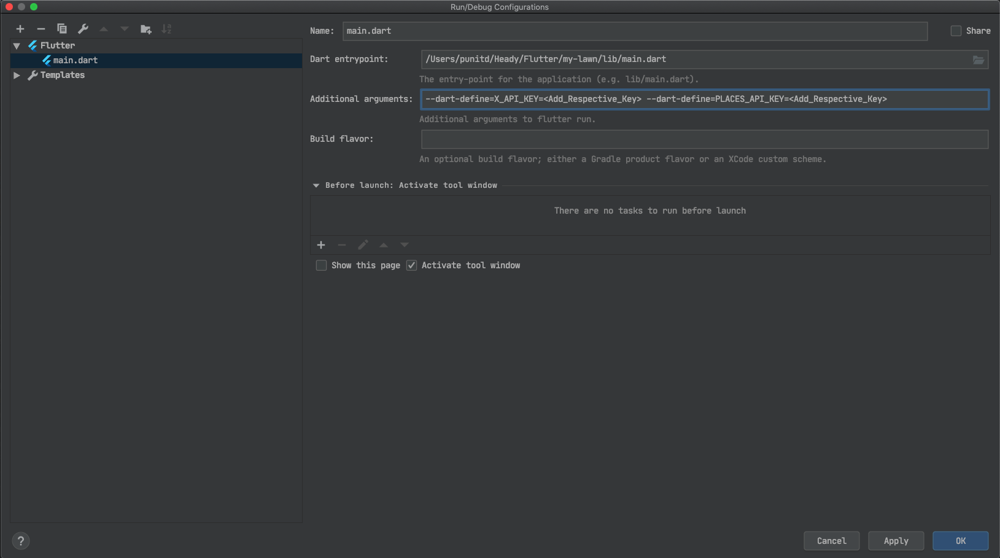

# My Lawn

## Basic installation
1) Download flutter SDK:
Mac: https://flutter.dev/docs/get-started/install/macos
Windows: https://flutter.dev/docs/get-started/install/windows

2) For Mac users only:
- Setup environment variables open terminal and execute command `nano ~/.zshrc` (for zsh Mac OS Catalina) `nano ~/.bash_profile` (for bash shell) export PATH="$PATH:[YOUR_PATH]/flutter/bin
- Install Xcode command line tools if you are on Mac OS Mojave:
    ```
    $ brew update
    $ brew install --HEAD usbmuxd
    $ brew link usbmuxd
    $ brew install --HEAD libimobiledevice
    $ brew install ideviceinstaller
    $ npm install -g ios-deploy
    ```

3) Install flutter doctor utility to check the flutter installation


4) **Android Studio** — Install Flutter and Dart plugins
- Start Android Studio.
- Open plugin preferences (**Preferences > Plugins** on Mac OS, **File > Settings > Plugins** on Windows).
- Select **Browse repositories**, select the Flutter plugin and click **Install**.
- Click **Yes** when prompted to install the Dart plugin.
- Click **Restart** when prompted.


5) **VSCode** - Install Flutter Extension


## Using Api Keys

### VSCode users:

If you use VSCode for development, in order to inject keys you need to define your `launch.json` under `.vscode` folder in project's root directory in following format:

File path : .vscode/launch.json

```
{
  "version": "0.2.0",
  "configurations": [
    {
      "name": "MyLawn-Debug",
      "request": "launch",
      "type": "dart",
      "flutterMode": "debug",
      "args": [
        "--dart-define",
        "DEV_API_KEY=<Add_Respective_Key>",
         "--dart-define",
        "RC_API_KEY=<Add_Respective_Key>", // Only required if you're using env switching feature
        "--dart-define",
        "PROD_API_KEY=<Add_Respective_Key>", // Only required if you're using env switching feature
        "--dart-define",
        "DEV_GIGYA_API_KEY=<Add_Respective_Key>",
        "--dart-define",
        "RC_GIGYA_API_KEY=<Add_Respective_Key>",// Only required if you're using env switching feature
        "--dart-define",
        "PROD_GIGYA_API_KEY=<Add_Respective_Key>",// Only required if you're using env switching feature
        "--dart-define",
        "DEV_CONTENTFUL_KEY=<Add_Respective_Key>",
        "--dart-define",
        "PROD_CONTENTFUL_KEY=<Add_Respective_Key>",
        "--dart-define",
        "PLACES_API_KEY=<Add_Respective_Key>",
        "--dart-define",
        "GMAPS_ANDROID_KEY=<Add_Respective_Key>",
        "--dart-define",
        "GMAPS_IOS_KEY=<Add_Respective_Key>",
        "--dart-define",
        "PSPIDER_LOCAL_SELLERS_API_KEY=<Add_Respective_Key>",
        "--dart-define",
        "PSPIDER_ONLINE_STORES_API_KEY=<Add_Respective_Key>",
        "--dart-define",
        "ADOBE_ANDROID_KEY_DEV=<Add_Respective_Key>",
        "--dart-define",
        "ADOBE_ANDROID_KEY_PROD=<Add_Respective_Key>",
        "--dart-define",
        "ADOBE_IOS_KEY_DEV=<Add_Respective_Key>",
        "--dart-define",
        "ADOBE_IOS_KEY_PROD=<Add_Respective_Key>",
        "--dart-define",
        "GIGYA_API_KEY=<Add_Respective_Key>",
        "--dart-define",
        "DEV_CONTENTFUL_KEY=<Add_Respective_Key>",
        "--dart-define",
        "PROD_CONTENTFUL_KEY=<Add_Respective_Key>",
        "--dart-define",
        "RECURLY_PUBLIC_KEY=<Add_Respective_Key>",
        "--dart-define",
        "PROD_RECURLY_PUBLIC_KEY=<Add_Respective_Key>",
        "--dart-define",
        "DTC_INFRASTRUCTURE_SANDBOX_ANDROID_API_KEY=<Add_Respective_Key>",
        "--dart-define",
        "DTC_INFRASTRUCTURE_SANDBOX_IOS_API_KEY=<Add_Respective_Key>",
        "--dart-define",
        "DTC_INFRASTRUCTURE_SANDBOX_ANDROID_APP_ID=<Add_Respective_Key>",
        "--dart-define",
        "DTC_INFRASTRUCTURE_SANDBOX_IOS_APP_ID=<Add_Respective_Key>",
        "--dart-define",
        "DTC_INFRASTRUCTURE_SANDBOX_MESSAGE_SENDER_ID=<Add_Respective_Key>",
        "--dart-define",
        "GOOGLE_REVERSED_CLIENT_ID_IOS_KEY=<Add_Respective_Key>", //Use DEV_GOOGLE_REVERSED_CLIENT_ID_IOS_KEY
      ],
    },
    {
      "name": "MyLawn-Release",
      "request": "launch",
      "type": "dart",
      "flutterMode": "release",
      "args": [
         "--dart-define",
        "DEV_API_KEY=<Add_Respective_Key>",
         "--dart-define",
        "RC_API_KEY=<Add_Respective_Key>",// Only required if you're using env switching feature
        "--dart-define",
        "PROD_API_KEY=<Add_Respective_Key>",// Only required if you're using env switching feature
        "--dart-define",
        "DEV_GIGYA_API_KEY=<Add_Respective_Key>",
        "--dart-define",
        "RC_GIGYA_API_KEY=<Add_Respective_Key>",// Only required if you're using env switching feature
        "--dart-define",
        "PROD_GIGYA_API_KEY=<Add_Respective_Key>",// Only required if you're using env switching feature
        "--dart-define",
        "DEV_CONTENTFUL_KEY=<Add_Respective_Key>",
        "--dart-define",
        "PROD_CONTENTFUL_KEY=<Add_Respective_Key>",
        "--dart-define",
        "PLACES_API_KEY=<Add_Respective_Key>",
        "--dart-define",
        "GMAPS_ANDROID_KEY=<Add_Respective_Key>",
        "--dart-define",
        "GMAPS_IOS_KEY=<Add_Respective_Key>",
        "--dart-define",
        "PSPIDER_LOCAL_SELLERS_API_KEY=<Add_Respective_Key>",
        "--dart-define",
        "PSPIDER_ONLINE_STORES_API_KEY=<Add_Respective_Key>",
        "--dart-define",
        "ADOBE_ANDROID_KEY_DEV=<Add_Respective_Key>",
        "--dart-define",
        "ADOBE_ANDROID_KEY_PROD=<Add_Respective_Key>",
        "--dart-define",
        "ADOBE_IOS_KEY_DEV=<Add_Respective_Key>",
        "--dart-define",
        "ADOBE_IOS_KEY_PROD=<Add_Respective_Key>",
        "--dart-define",
        "RECURLY_PUBLIC_KEY=<Add_Respective_Key>",
        "--dart-define",
        "PROD_RECURLY_PUBLIC_KEY=<Add_Respective_Key>",
         "--dart-define",
         "DTC_INFRASTRUCTURE_SANDBOX_ANDROID_API_KEY=<Add_Respective_Key>",
         "--dart-define",
         "DTC_INFRASTRUCTURE_SANDBOX_IOS_API_KEY=<Add_Respective_Key>",
         "--dart-define",
         "DTC_INFRASTRUCTURE_SANDBOX_ANDROID_APP_ID=<Add_Respective_Key>",
         "--dart-define",
         "DTC_INFRASTRUCTURE_SANDBOX_IOS_APP_ID=<Add_Respective_Key>",
         "--dart-define",
         "DTC_INFRASTRUCTURE_SANDBOX_MESSAGE_SENDER_ID=<Add_Respective_Key>",
         "--dart-define",
        "GOOGLE_REVERSED_CLIENT_ID_IOS_KEY=<Add_Respective_Key>", //Use DEV_GOOGLE_REVERSED_CLIENT_ID_IOS_KEY
      ]
    }
  ]
}
```

### Android Studio users:

If you use Android Studio for development, these keys can injected by following steps:

1. Go to Edit Configuration



2. Add additional arguments



<br />

And, if you don't like GUI approach you can modify following property in `.idea/workspace.xml` file as well:

```
<component name="RunManager">
    <configuration name="main.dart" type="FlutterRunConfigurationType" factoryName="Flutter">
      <option name="additionalArgs" value="--dart-define=DEV_API_KEY=<key> --dart-define=RC_API_KEY=<key> --dart-define=PROD_API_KEY=<key> --dart-define=DEV_GIGYA_API_KEY=<key> --dart-define=RC_GIGYA_API_KEY=<key> --dart-define=PROD_GIGYA_API_KEY=<key> --dart-define=DEV_CONTENTFUL_KEY=<key> --dart-define=PROD_CONTENTFUL_KEY=<key> --dart-define=PLACES_API_KEY=<key> --dart-define=GMAPS_ANDROID_KEY=<key> --dart-define=GMAPS_IOS_KEY=<key> --dart-define=PSPIDER_LOCAL_SELLERS_API_KEY=<key> --dart-define=PSPIDER_ONLINE_STORES_API_KEY=<key> --dart-define=ADOBE_ANDROID_KEY_DEV=<key> --dart-define=ADOBE_ANDROID_KEY_PROD=<key> --dart-define=ADOBE_IOS_KEY_DEV=<key> --dart-define=ADOBE_IOS_KEY_PROD=<key> --dart-define=GIGYA_API_KEY=<key> --dart-define=DEV_CONTENTFUL_KEY=<key> --dart-define=PROD_CONTENTFUL_KEY=<key> --dart-define=RECURLY_PUBLIC_KEY=<key> --dart-define=PROD_RECURLY_PUBLIC_KEY=<key> --dart-define=DTC_INFRASTRUCTURE_SANDBOX_ANDROID_API_KEY=<key> --dart-define=DTC_INFRASTRUCTURE_SANDBOX_IOS_API_KEY=<key> --dart-define=DTC_INFRASTRUCTURE_SANDBOX_ANDROID_APP_ID=<key> --dart-define=DTC_INFRASTRUCTURE_SANDBOX_IOS_APP_ID=<key> --dart-define=DTC_INFRASTRUCTURE_SANDBOX_MESSAGE_SENDER_ID=<key> --dart-define=GOOGLE_REVERSED_CLIENT_ID_IOS_KEY=<key>" />
      <option name="filePath" value="$PROJECT_DIR$/lib/main.dart" />
      <method v="2" />
    </configuration>
  </component>
```

> **Note :** You don't need to provide all the keys here. Only the one you need for working on your feature. If you need any keys you can get them on Bitrise.

<br />

---

<br />

## Adding Keys for Native Sdk/Plugins:

If you're adding native sdks/plugins in the project which requires keys to be injected via --dart-define in iOS and Android please add default values for the new key in following files.

> **Note :** Only the person integrating the native sdk should do it once. This instruction is not applicable to others. They don't need to touch these files and add these default values.

### Android:

- `android/app/build.gradle`

```
def dartEnvironmentVariables = [
    GMAPS_ANDROID_KEY: '###'
    <ADD_YOUR_NEW_KEY>: '###'
]
```

### iOS:

- `ios/Flutter/Environment-defaults.xcconfig`

```
GMAPS_IOS_KEY=###
<ADD_YOUR_NEW_KEY>='###'
```
